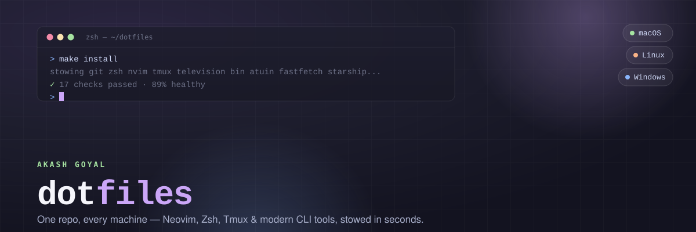

# dotfiles

<p align="center">
  
</p>

<p align="center">
  <a href="https://github.com/itsmeakashgoyal/dotfiles/actions/workflows/build_and_test.yml"></a>
  <a href="https://opensource.org/licenses/BSD-2-Clause"></a>
  <a href="https://www.apple.com/macos/"></a>
  <a href="https://ubuntu.com/"></a>
  <a href="https://learn.microsoft.com/powershell/"></a>
  <a href="https://www.zsh.org/"></a>
  <a href="https://neovim.io/"></a>
  <a href="https://starship.rs/"></a>
  <a href="https://github.com/itsmeakashgoyal/dotfiles/commits/master"></a>
</p>

<p align="center">
  A single, automated dotfiles repo for <b>macOS</b>, <b>Linux</b>, and <b>Windows</b> — Neovim, Zsh/PowerShell,
  Tmux, Git, and a modern CLI toolchain, managed with <a href="https://www.gnu.org/software/stow/">GNU Stow</a>
  on Unix and native symlinks on Windows. Clone it, run one command, get the same environment everywhere.
</p>

> **Warning:** These dotfiles are personalized and will overwrite existing configurations.
> Fork the repo and review the scripts before running on your machine.

---

## Preview

<p align="center">
  
</p>

<p align="center">
  <sub>Real recording of this repo's actual setup — the startup banner, <code>eza</code>-powered
  listings, the custom <code>dutils</code> CLI, and Neovim, captured with
  <a href="https://github.com/charmbracelet/vhs">VHS</a>.</sub>
</p>

---

## Contents

- [What's Included](#whats-included)
- [Quick Start](#quick-start)
- [How It Works](#how-it-works)
- [Uninstall](#uninstall)
- [Repository Structure](#repository-structure)
- [Documentation](#documentation)
- [Resources](#resources)
- [License](#license)

---

## What's Included

| | |
| --- | --- |
| **Zsh** | Modular config via `conf.d/`, Zinit plugin manager, Starship prompt, television fuzzy finder |
| **Neovim** | Lazy.nvim, LSP, Treesitter, Telescope, autocompletions |
| **Git** | 40+ aliases, delta diff viewer, XDG-compliant config |
| **Tmux** | TPM plugin manager, vim-aware pane switching, session persistence |
| **`dutils`** | One CLI for cleanup, SSH keygen, OS detection, interactive diffing, and more |
| **CLI tools** | macOS via Homebrew (`brew/Brewfile`); **Linux via Nix + Home Manager** (`nix/`, replaces linuxbrew) — eza, bat, ripgrep, fd, zoxide, and more. See [docs/NIX.md](docs/NIX.md) |

---

## Quick Start

### macOS / Linux — one-liner bootstrap

```bash
bash -c "$(curl -fsSL https://raw.githubusercontent.com/itsmeakashgoyal/dotfiles/master/bootstrap.sh)"
```

### macOS / Linux — standard install

```bash
git clone https://github.com/itsmeakashgoyal/dotfiles.git ~/dotfiles
cd ~/dotfiles
make install
exec zsh
```

> For prerequisites, platform-specific notes, and what the installer does, see **[Installation Guide](docs/INSTALLATION.md)**.

### Windows — one-click install

**Prerequisites:** PowerShell 5.1+ (built-in) or [PowerShell 7+](https://aka.ms/pscore6). No other tools needed — the script installs everything.

**Option A — fresh machine (run in PowerShell):**

```powershell
Set-ExecutionPolicy -ExecutionPolicy RemoteSigned -Scope CurrentUser
irm https://raw.githubusercontent.com/itsmeakashgoyal/dotfiles/master/install.ps1 | iex
```

**Option B — already cloned:**

```powershell
Set-ExecutionPolicy -ExecutionPolicy RemoteSigned -Scope CurrentUser
cd ~\dotfiles
.\install.ps1
```

**What it installs automatically:**

| Step | What happens |
| --- | --- |
| **Scoop** | Package manager bootstrapped if missing |
| **CLI tools** | ripgrep, fzf, bat, eza, fd, zoxide, neovim, lazygit, delta, … |
| **PS modules** | `PSReadLine` (Vi mode), `PSFzf` (fzf integration), `Terminal-Icons` |
| **Symlinks** | PowerShell profile, nvim, git, tmux, television, atuin, fastfetch |
| **Neovim** | Config linked; lazy.nvim bootstraps on first `nvim` launch |

> **Symlinks require** either Administrator privileges or [Developer Mode](ms-settings:developers)
> enabled (`Settings → System → For Developers`).

<details>
<summary><b>PowerShell profile features</b></summary>

| Shortcut / Alias | What it does |
| --- | --- |
| `Ctrl+T` | fzf file picker |
| `Ctrl+R` | fzf history search |
| `Alt+C` | fzf cd into directory |
| `ls` / `ll` / `la` / `lt` | eza with icons and git status |
| `cat` | bat with syntax highlighting |
| `grep` | ripgrep (`rg`) |
| `find` | fd |
| `z <dir>` | zoxide smart jump |
| `rm -rf <path>` | recursive force delete |
| `rmdir <dir>` | remove directory (with `-p` for empty parents) |
| `touch` / `mkcd` | create file / mkdir + cd |
| `gs` / `gc` / `gp` / `glog` | git shortcuts |
| `glf` | interactive git log with fzf |
| `rgf` | ripgrep → fzf → open in editor |
| `jk` / `kj` | exit Vi insert mode (mirrors zsh config) |

</details>

---

## How It Works

Every top-level directory (`git/`, `zsh/`, `nvim/`, `tmux/`, …) is a **Stow package**. Each package
mirrors the target path relative to `$HOME`:

```text
dotfiles/nvim/.config/nvim/init.lua
                │
    stow nvim   │   creates symlink
                ▼
~/.config/nvim  →  ~/dotfiles/nvim/.config/nvim
```

Running `stow <package>` from the repo root creates the correct symlinks automatically. Edits in the
repo take effect immediately — no re-linking needed.

---

## Uninstall

To remove the dotfiles setup from your machine, run from the repo root:

```bash
cd ~/dotfiles
make uninstall
```

After one confirmation, it gracefully and completely reverses the install:

1. **Restores your login shell** to the OS default (`/bin/zsh` on macOS, `/bin/bash` on Linux)
2. **Removes all dotfile symlinks** (unstows every package) and sweeps any leftovers
3. **Clears generated caches** (zsh compdump, stow backups)
4. **Uninstalls Nix** if present — removes Home Manager packages first, then Nix itself
5. **Uninstalls Homebrew** if present — removes all its packages first, then brew itself

> **⚠️ This is a complete removal.** Both package managers are uninstalled
> entirely, including any packages you installed **outside** these dotfiles.
> Your repo, shell history, and personal data (`~/.ssh`, git config, etc.) are
> left untouched.

**Preview first (recommended)** — shows every action without changing anything:

```bash
make uninstall dry=1
```

**Skip the confirmation prompt** (e.g. for scripts/CI):

```bash
make uninstall force=1
```

The repo itself is left on disk — delete it manually if you want it gone:

```bash
rm -rf ~/dotfiles
```

See [docs/NIX.md](docs/NIX.md) for Nix-specific removal notes.

---

## Repository Structure

```text
dotfiles/
├── git/                       → ~/.config/git/          Git config & aliases
├── zsh/                       → ~/.config/zsh/          Zsh shell configuration
├── nvim/                      → ~/.config/nvim/         Neovim editor setup
├── tmux/                      → ~/.config/tmux/         Tmux multiplexer
├── powershell/                → ~/Documents/PowerShell/ PowerShell profile (Windows)
├── brew/                      Brewfile — Homebrew package manifest (macOS)
├── nix/                       Home Manager flake — Linux packages (replaces linuxbrew)
├── scripts/                   Setup, verification, and the dutils CLI
├── settings/                  App preferences (iTerm, Sublime)
├── docs/                      Guides + this README's banner/demo assets
├── install.sh                 Main installer (macOS/Linux)
├── install.ps1                Main installer (Windows)
├── bootstrap.sh               One-liner bootstrap for fresh machines
└── Makefile                   Stow management & diagnostics
```

---

## Documentation

| Document | Description |
| --- | --- |
| **[Installation](docs/INSTALLATION.md)** | Prerequisites, platform notes, what the installer does |
| **[Usage](docs/USAGE.md)** | Makefile commands, updating, adding packages, diagnostics |
| **[Nix (Linux)](docs/NIX.md)** | Nix + Home Manager package management on Linux (replaces linuxbrew) |
| **[Customization](docs/CUSTOMIZATION.md)** | Personalizing Git, Zsh, Neovim, Tmux configs |
| **[Troubleshooting](docs/TROUBLESHOOTING.md)** | Common issues, debug workflow, uninstalling |
| **[Architecture](docs/ARCHITECTURE.md)** | Deep dive: Stow internals, Zsh flow, scripts, CI, XDG |
| **[Contributing](CONTRIBUTING.md)** | How to contribute, code style, PR process |
| **[Security](SECURITY.md)** | Secrets management and security practices |

---

## Resources

- [GNU Stow](https://www.gnu.org/software/stow/) -- Symlink farm manager
- [Homebrew](https://brew.sh/) -- Package manager for macOS and Linux
- [Neovim](https://neovim.io/) -- Hyperextensible text editor
- [Starship](https://starship.rs/) -- Cross-shell prompt used by default here
- [VHS](https://github.com/charmbracelet/vhs) -- Terminal demo recorder (used for the preview above)
- [Awesome Dotfiles](https://github.com/webpro/awesome-dotfiles) -- Community dotfiles resources

---

## License

BSD 2-Clause License. See [LICENSE](LICENSE) for details.

---

<p align="center"><b>Akash Goyal</b> — <a href="https://github.com/itsmeakashgoyal">@itsmeakashgoyal</a></p>
